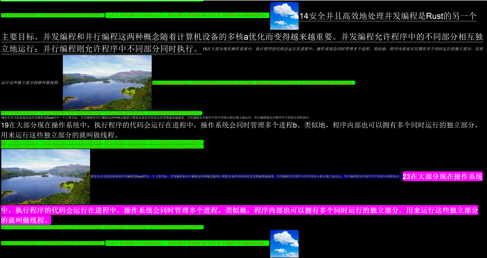
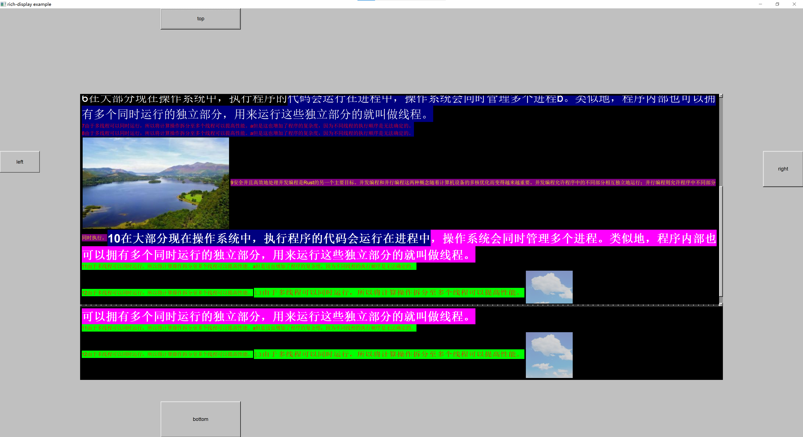

# fltkrs-richdisplay
这是一个专为`fltk-rs`开发的富文本展示组件项目，只能展示不能编辑，目标是作为`fltk-TextDisplay`组件的一个补充。 该组件的设计目标是提供更多的文本样式展示，甚至支持图形展示，主要的展示形式以行为主，从上向下、从左到右的流式布局。 `fltk-TextDisplay`仅支持`60`种颜色与字体的组合，而本组件设计的目的之一就是突破这个非常低的限制，可以随意组合字体、字号、颜色、下划线、粗体/斜体等，支持文本与图形混合排布。

该组件支持历史内容回顾。

使用方法示例：
```rust
#[tokio::main]
async fn main() {
    simple_logger::init_with_level(log::Level::Debug).unwrap();
    let app = app::App::default();
    let mut win = window::Window::default()
        .with_size(1000, 600)
        .with_label("rich-display example")
        .center_screen();
    win.make_resizable(true);

    let group = Group::default_fill();

    let mut btn1 = Button::new(200, 0, 100, 50, "top");
    let _ = Button::new(0, 200, 50, 50, "left");

    let mut rich_text = RichText::new(100, 100, 800, 400, None);
    let (sender, mut receiver) = tokio::sync::mpsc::channel::<UserData>(100);
    rich_text.set_notifier(sender);
    rich_text.set_buffer_max_lines(50);

    btn1.set_callback({
        |_| {
            debug!("btn clicked");
        }
    });

    let _ = Button::new(950, 200, 50, 50, "right");

    let mut btn4 = Button::new(200, 550, 100, 50, "bottom");
    btn4.set_callback(|_| {
        debug!("btn2 clicked");
    });

    group.end();

    win.end();
    win.show();

    let (global_sender, global_receiver) = app::channel::<GlobalMessage>();

    let global_sender_rc = global_sender.clone();
    tokio::spawn(async move {
        while let Some(data) = receiver.recv().await {
            if data.text.starts_with("14") {
                let toggle = !data.underline;
                let update_options = RichDataOptions::new(data.id).underline(toggle);
                global_sender_rc.send(GlobalMessage::UpdateData(update_options));
            } else if data.text.starts_with("22") {
                global_sender_rc.send(GlobalMessage::DisableData(data.id));
            } else if data.text.starts_with("23") {
                let toggle = !data.strike_through;
                let update_options = RichDataOptions::new(data.id).strike_through(toggle);
                global_sender_rc.send(GlobalMessage::UpdateData(update_options));
            } else if data.text.starts_with("25") {
                let update_options = RichDataOptions::new(data.id).clickable(false).expired(true).bg_color(Color::DarkGreen);
                global_sender_rc.send(GlobalMessage::UpdateData(update_options));
            } else if data.data_type == DataType::Image {
                global_sender_rc.send(GlobalMessage::DisableData(data.id));
            }
        }
    });

    // 注意！在linux环境下Image不能放在tokio::spawn(future)里面，因其会导致应用失去正常响应，无法关闭。目前原因未知。
    let img1 = SharedImage::load("res/1.jpg").unwrap();
    let (img1_width, img1_height, img1_data) = (img1.width(), img1.height(), img1.to_rgb_data());
    let img2 = SharedImage::load("res/2.jpg").unwrap();
    let (img2_width, img2_height, img2_data) = (img2.width(), img2.height(), img2.to_rgb_data());


    tokio::spawn(async move {
        for i in 0..2 {
            let turn = i * 13;
            let mut data: Vec<UserData> = Vec::from([
                UserData::new_text(format!("{}安全并且高效地处理并发编程是Rust的另一个主要目标。并发编程和并行编程这两种概念随着计算机设备的多核a优化而变得越来越重要。并发编程允许程序中的不同部分相互独立地运行；并行编程则允许程序中不同部分同时执行。", turn + 1)).set_underline(true).set_font(Font::Helvetica, 38).set_bg_color(Some(Color::DarkYellow)).set_clickable(true),
                UserData::new_text(format!("{}在大部分现在操作系统中，执行程序的代码会运行在进程中，操作系统会同时管理多个进程。类似地，程序内部也可以拥有多个同时运行的独立部分，用来运行这些独立部分的就叫做线程。", turn + 2)).set_font(Font::HelveticaItalic, 18).set_bg_color(Some(Color::Green)),
                UserData::new_image(img1_data.clone(), img1_width, img1_height),
                UserData::new_text(format!("{}由于多线程可以同时运行，所以将计算操作拆分至多个线程可以提高性能。a但是这也增加了程序的复杂度，因为不同线程的执行顺序是无法确定的。\r\n", turn + 3)).set_fg_color(Color::Red).set_bg_color(Some(Color::Green)).set_underline(true),
                UserData::new_text(format!("{}由于多线程可以同时运行，所以将计算操作拆分至多个线程可以提高性能。但是这也增加了程序的复杂度，因为不同线程的执行顺序是无法确定的。\r\n", turn + 4)).set_fg_color(Color::Red).set_bg_color(Some(Color::Green)),
                UserData::new_text(format!("{}安全并且高效地处理并发编程是Rust的另一个主要目标。并发编程和并行编程这两种概念随着计算机设备的多核优化而变得越来越重要。并发编程允许程序中的不同部分相互独立地运行；并行编程则允许程序中不同部分同时执行。\r\n", turn + 5)).set_font(Font::Helvetica, 9).set_underline(true),
                UserData::new_text(format!("{}在大部分现在操作系统中，执行程序的代码会运行在进程中，操作系统会同时管理多个进程b。类似地，程序内部也可以拥有多个同时运行的独立部分，用来运行这些独立部分的就叫做线程。\r\n", turn + 6)).set_font(Font::Helvetica, 32),
                UserData::new_text(format!("{}由于多线程可以同时运行，所以将计算操作拆分至多个线程可以提高性能。a但是这也增加了程序的复杂度，因为不同线程的执行顺序是无法确定的。\r\n", turn + 7)).set_fg_color(Color::Red).set_bg_color(Some(Color::Green)),
                UserData::new_text(format!("{}由于多线程可以同时运行，所以将计算操作拆分至多个线程可以提高性能。a但是这也增加了程序的复杂度，因为不同线程的执行顺序是无法确定的。\r\n", turn + 8)).set_fg_color(Color::Red).set_bg_color(Some(Color::Green)),
                UserData::new_image(img1_data.clone(), img1_width, img1_height).set_clickable(true),
                UserData::new_text(format!("{}安全并且高效地处理并发编程是Rust的另一个主要目标。并发编程和并行编程这两种概念随着计算机设备的多核优化而变得越来越重要。并发编程允许程序中的不同部分相互独立地运行；并行编程则允许程序中不同部分同时执行。", turn + 9)).set_fg_color(Color::Yellow).set_bg_color(Some(Color::DarkBlue)).set_clickable(true),
                UserData::new_text(format!("{}在大部分现在操作系统中，执行程序的代码会运行在进程中，操作系统会同时管理多个进程。类似地，程序内部也可以拥有多个同时运行的独立部分，用来运行这些独立部分的就叫做线程。\r\n", turn + 10)).set_font(Font::HelveticaBold, 32).set_bg_color(Some(Color::Magenta)).set_clickable(true),
                UserData::new_text(format!("{}由于多线程可以同时运行，所以将计算操作拆分至多个线程可以提高性能。a但是这也增加了程序的复杂度，因为不同线程的执行顺序是无法确定的。\r\n", turn + 11)).set_fg_color(Color::Red).set_bg_color(Some(Color::Green)),
                UserData::new_text(format!("{}由于多线程可以同时运行，所以将计算操作拆分至多个线程可以提高性能。", turn + 12)).set_fg_color(Color::Red).set_bg_color(Some(Color::Green)).set_clickable(true),
                UserData::new_text(format!("{}由于多线程可以同时运行，所以将计算操作拆分至多个线程可以提高性能。", turn + 13)).set_fg_color(Color::Red).set_bg_color(Some(Color::Green)).set_font(Font::Courier, 18),
                UserData::new_image(img2_data.clone(), img2_width, img2_height).set_clickable(true),
            ]);
            data.reverse();
            while let Some(data_unit) = data.pop() {
                global_sender.send(GlobalMessage::ContentData(data_unit));
                tokio::time::sleep(Duration::from_millis(30)).await;
            }
        }

        debug!("Sender closed");
    });


    while app.wait() {
        if let Some(msg) = global_receiver.recv() {
            match msg {
                GlobalMessage::ContentData(data) => {
                    rich_text.append(data);
                }
                GlobalMessage::UpdateData(options) => {
                    rich_text.update_data(options);
                }
                GlobalMessage::DisableData(id) => {
                    rich_text.disable_data(id);
                }
                _ => {}
            }
        }

        // app::sleep(0.016);
        app::sleep(0.001);
        app::awake();
    }
}
```

下图是目前已实现的图文混排效果预览图：

主内容预览


回顾区预览，包含文本选择


待开发：
1. - [ ] 处理图片缓存问题，避免重复占用内存。
2. - [ ] 添加回顾区检索和定位API。